# Integration_of_CNN_with_DevOps-MLOps_Training (given by Mr. Vimal Daga sir)

## Work Description :

 #### 1. Create container image that’s has Python3 and Keras or numpy  installed  using dockerfile 
 #### 2. When we launch this image, it should automatically starts train the model in the container.
 #### 3. Create a job chain of job1, job2, job3, job4 and job5 using build pipeline plugin in Jenkins 
 #### 4.  Job1 : Pull  the Github repo automatically when some developers push repo to Github.
 #### 5.  Job2 : By looking at the code or program file, Jenkins should automatically start the respective machine learning software installed interpreter install image container to deploy code  and start training( eg. If code uses CNN, then Jenkins should start the container that has already installed all the softwares required for the cnn processing).
 #### 6. Job3 : Train your model and predict accuracy or metrics.
 #### 7. Job4 : if metrics accuracy is less than 80%  , then tweak the machine learning model architecture.
 #### 8. Job5: Retrain the model or notify that the best model is being created
 #### 9. Create One extra job job6 for monitor : If container where app is running. fails due to any reason then this job should automatically start the container again from where the last trained model left
 
## Pre-requisite :
  * OS: Base OS is Windows 10. Server OS is RedHat Enterprise Linux 8 (RHEL8) in Virtual Box.
  * In RHEL8 some of the softwares needed are Docker (also need the centos:latest image downloaded in it), Jenkins (also github, build pipeline and email extension plugin should be installed in it).
  * In Windows we need git bash software.
  * At the starting stop the firewalld in RHEL8 and start the docker and jenkins services.
  
## Let's see step by step how to achieve this :

### 1. Creating the CNN python3 code :
   * At first I build the CNN architecture. Here I used binary classification. You can find this code in the link : https://github.com/raktim00/Integration_of_CNN_with_DevOps-MLOps_Training/blob/master/Task3.py
   * Remember one core thing in this code that we are gonna run it on a Docker Container so we have to attatch a volume in out container to save the *accuracy.txt* file and that's why you have to mention the full location where you mounted that volume.

### 2. Creating Dockerfile and Building Personal Image using it :
   * Just see the below mentioned picture. Here I create one Dockerfile and run the build command. Remember one thing you have to run this command particularly on that folder where you **Dockerfile** exits.
   * Here is the link of Dockerfile :https://github.com/raktim00/Integration_of_CNN_with_DevOps-MLOps_Training/blob/master/Dockerfile 
   
   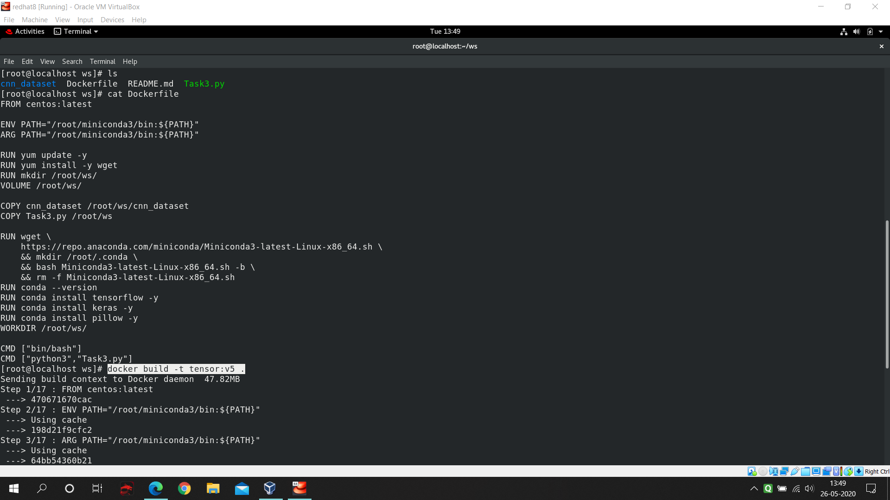

### 3. Giving power to Jenkins user in RHEL8 :
   * I had already mentioned in my previous project of Jenkins that how we give jenkins user all the power of linux. It's needed to run Docker using Jenkins. Here is the link where you can find that : https://github.com/raktim00/DevOps_Home_Work
   
### 4. At first email configuration in Jenkins :
   * Go to **Manage Jenkins** then **Configuration** and then scroll drown to bottom of the page and if your **email extension** is installed properly then you will find this option mentioned in below picture. Follow the picture and Configure Email in Jenkins to get email notification from Jenkins.
   
   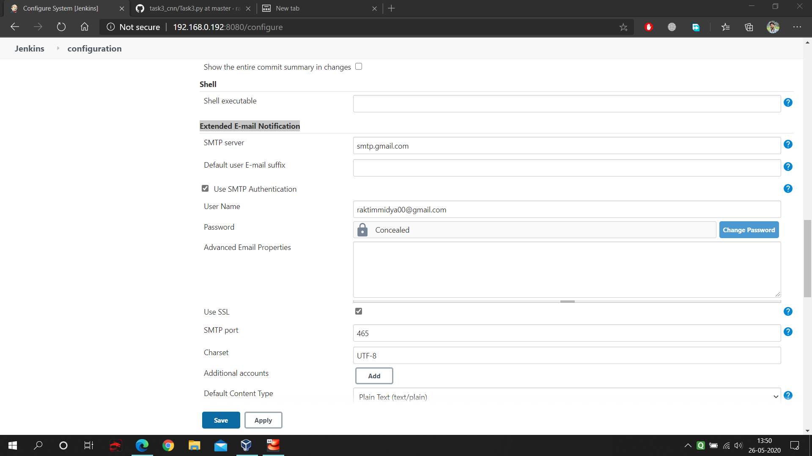
   
### 5. Building Job1 in Jenkins :
   * If your **GitHub extension** is installed properly then you will be able to put you github repo address in SCM portion of Job1 configuration. For reference follow the below picture.
   
   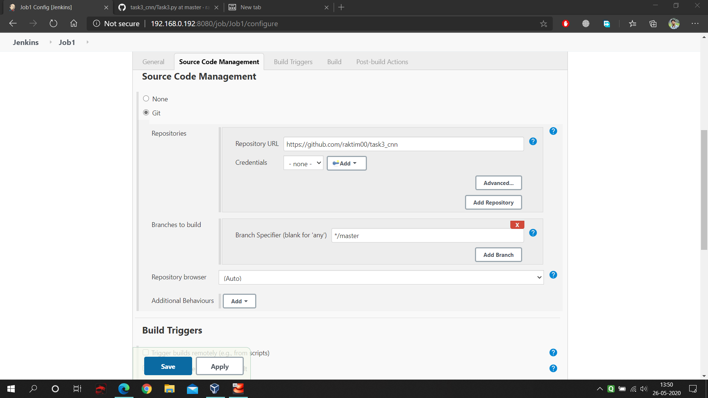
   
   * Next thing you have to copy the downloaded codes to your working space. For that in execute shell just write the respective code. For reference follow the below picture.
   
   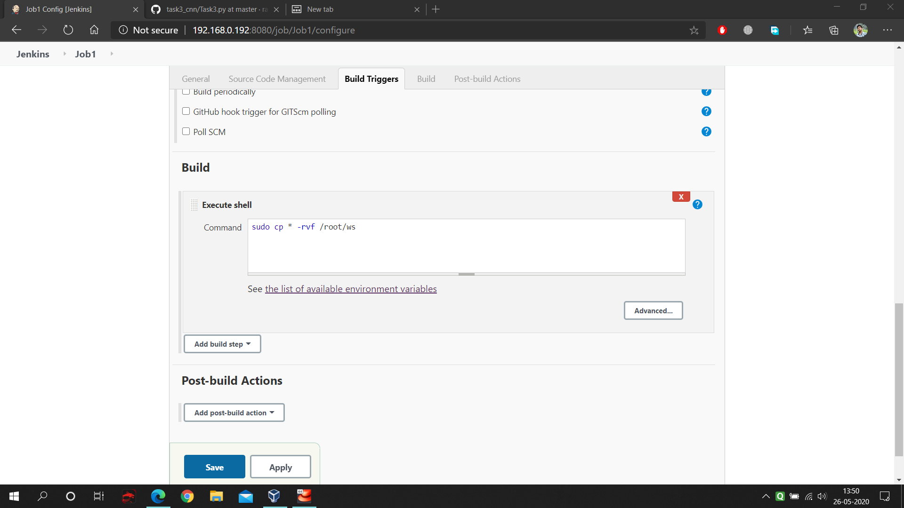
   
### 6. Building Job2 in Jenkins :
   * Now we have to start the CNN required libraries installed container. Also one more thing in **Build Trigger** option just select **Build after other projects are build** and give **Job1**. Now what will happen as soon as your Job1 complete it will automatically start the job2. For reference follow the below picture.
   
   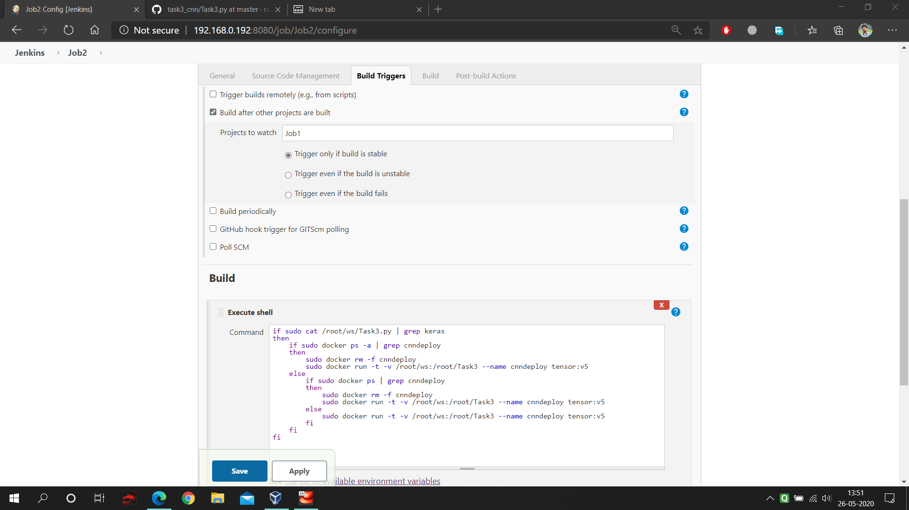
   
### 7. Building Job3 in Jenkins :
   * Now we have to check our accuracy. For that we have job3. Here if accuracy satisfies our need then It will trigger Job4 and if accuracy don't satisfy it will again start training the model with different architecture, also if will trigger Job4 after each build. For reference follow the below picture.
   
   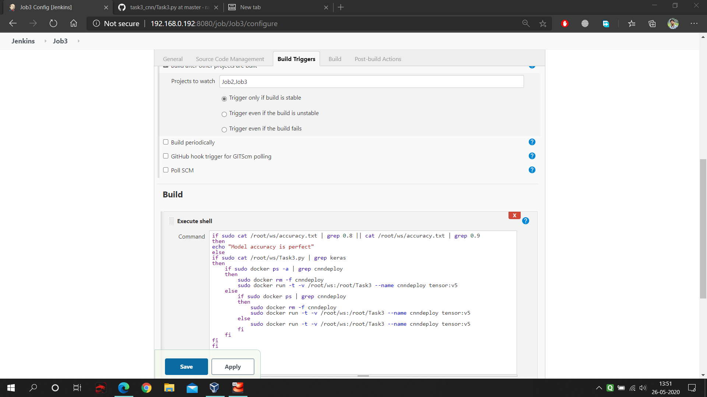
   
### 8. Building Job4 in Jenkins :
   * Here again the build will check the accuracy. If accuracy satisfies then it will execute the shell, otherwise it gonna fail the shell execution. For reference follow the below picture.
   
   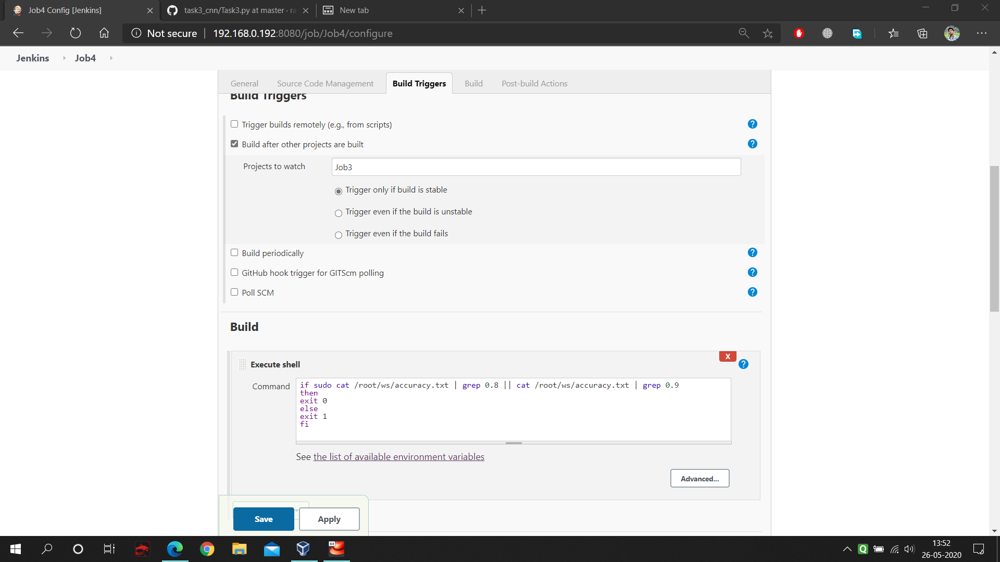
   
   * Now we have to configure email in Job4. Whenever the build gets successful it will send the success message to the developer. For reference follow the below picture.
   
   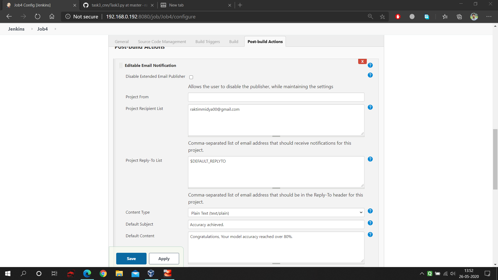
   
   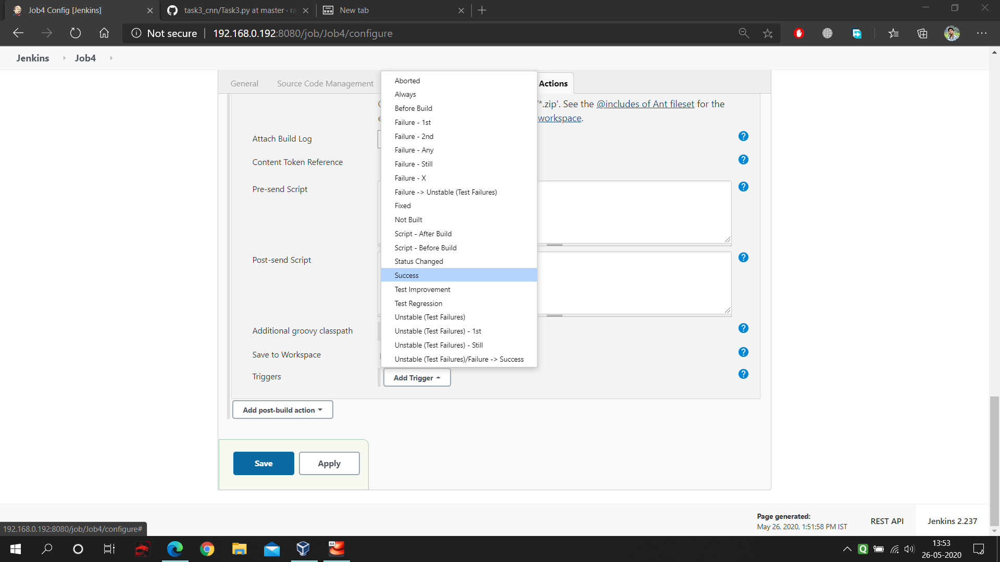
   
   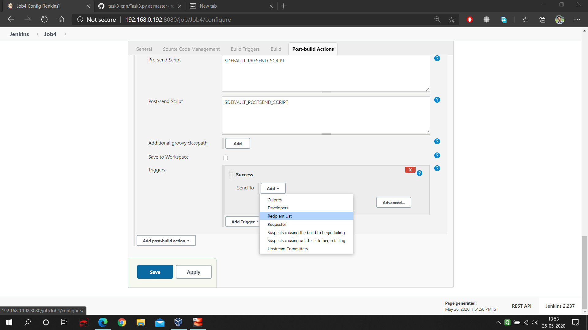

### 9. Building Job5 in Jenkins :
   * It's the last job. Here you have select that after **Job2** it will be triggered and as Poll SCM is configured it will keep on building it self in each minute. For reference follow the below picture.
   
   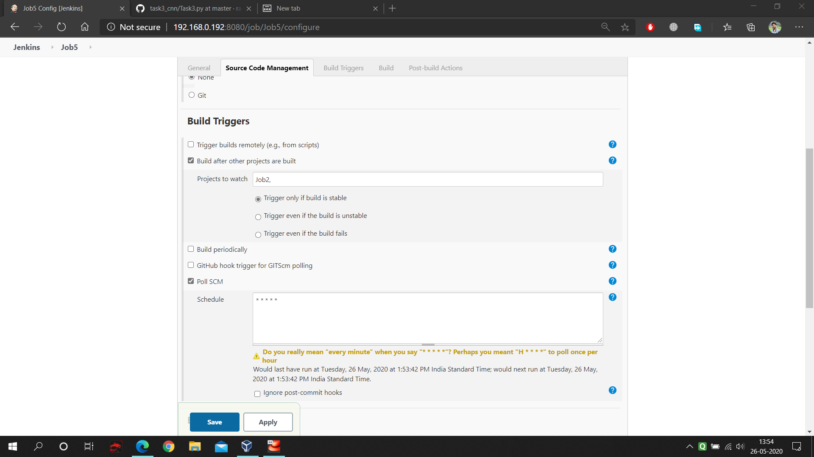
   
   * This Job keeps on checking if our container is running or not. Due to any reason if container failed then it will again start that. For reference follow the below picture.
   
   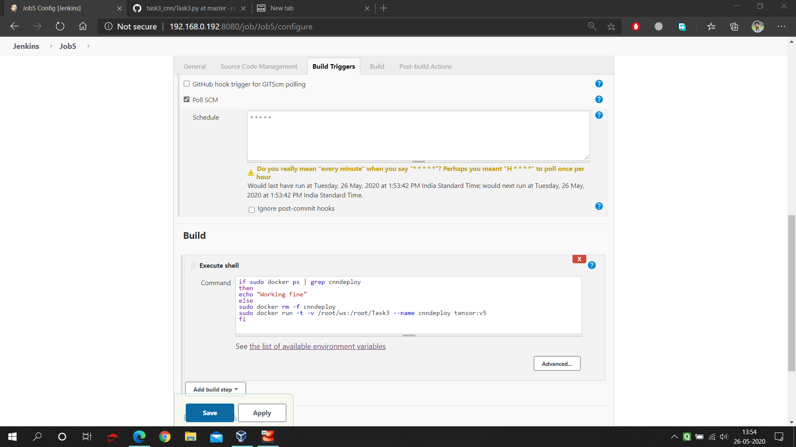

### 10. Last work to create build pipeline :
   * Now lastly you have to create one **view** in Jenkins that is build pipeline. But remember you should have **build pipeline** extension installed in your Jenkins. And after creating build pipeline you will see this kind of visual like as mentioned in below picture.
   
   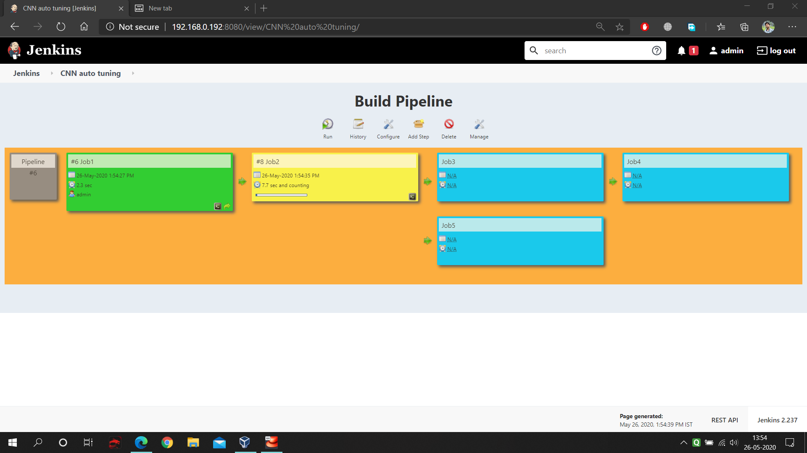
   
## Great,everything is done. Now let's see what kinds of outputs we will get.
  #### Don't forget to build the Jenkins Architecture from Build Pipeline.
  
### 1. Job1 output observation :
   * Here you will see that it fetches the code from github and deployed to your workspace.
   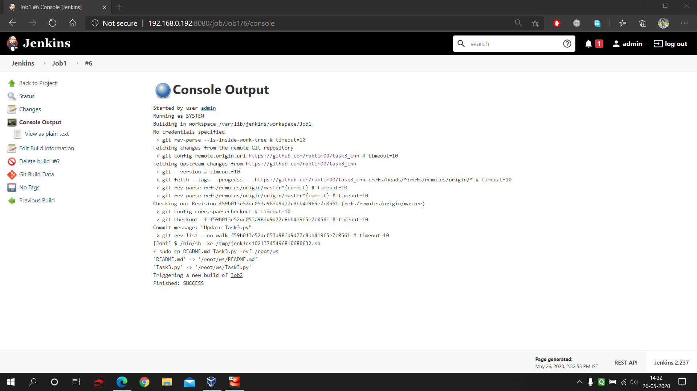
   
### 2. Job2 output observation :
   * Here you will see that it at first checks if the code is CNN or not. Then it started the container.
   
   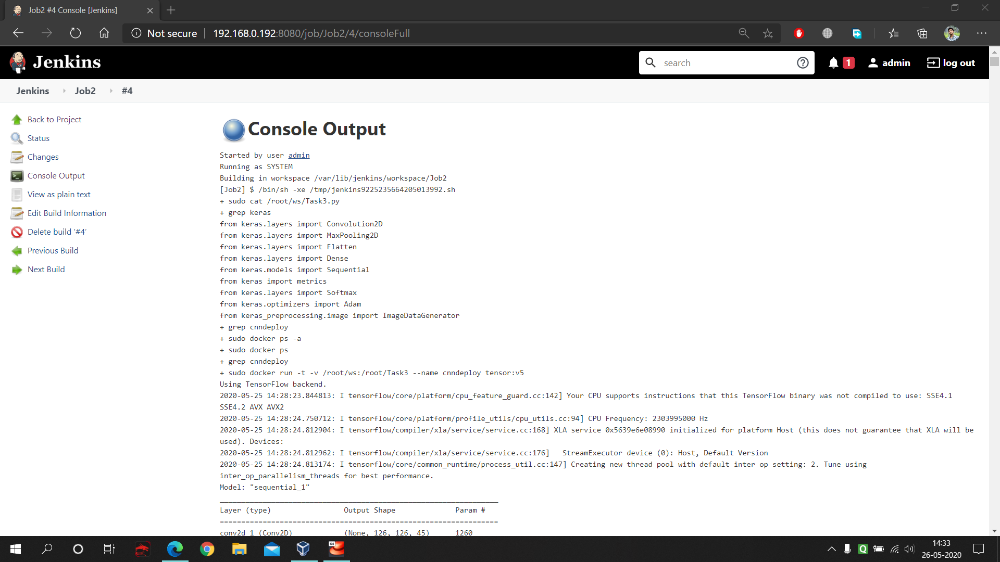
   
   * Also in this output you will fine one extra thing that what random architecture of CNN layers it takes.
   
   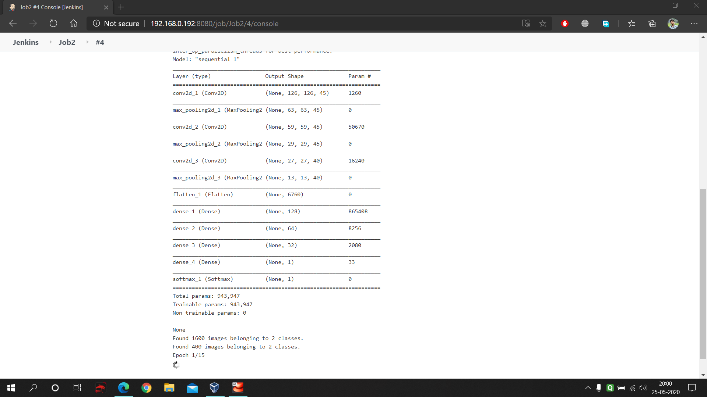
   
### 3. Job3 output observation :
   * You will see when ever it get the accuracy of it's satisfaction then it will start building job4. Also remember if it don't find the accuracy then it will again trigger it self and start to build the model.
   
   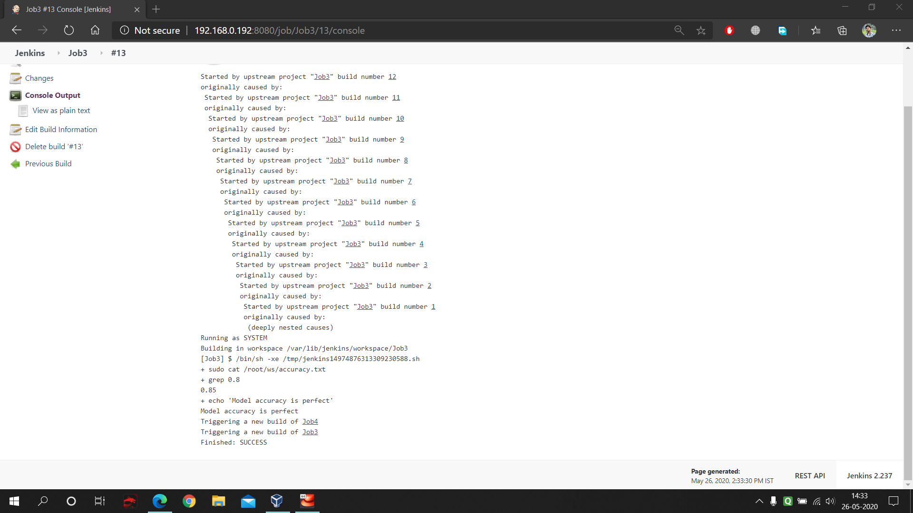
   
### 4. Job4 output observation :
   * Here you will see when the Job4 gets the desired accuracy it send the email to the developer.
   
   
   
### 5. Job5 output observation :
   * Here you will see that it keeps on checking if the cnn container is running or not, if somehow the container fails then it will again start that.
   
   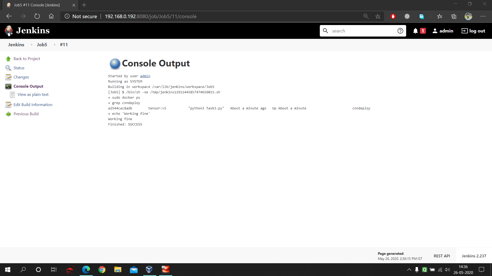
   
## Future Possibilities :
   * 1st of all, these kinds of model building takes lots of CPU and RAM, that's why it's always better to practice these things in Cloud Computing.
   * 2nd, we can make this work more robust using Kubernetes with Jenkins.
   * 3rd, For CNN code rather that using random function we can make it more intelligent in which it will automatically adds layers based on previous results.
   
### Lastly thank you so much Vimal Daga Sir, for teaching something extraordinary.
#### One big thank you to my friend Hemant Sharma, cause he helps me to learn some new things that I applied in this project.
